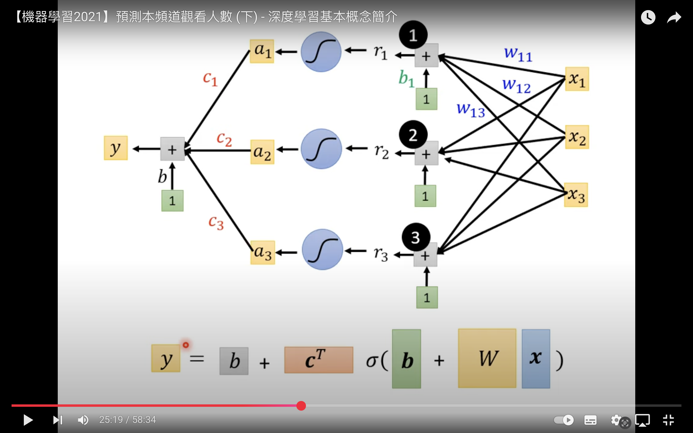
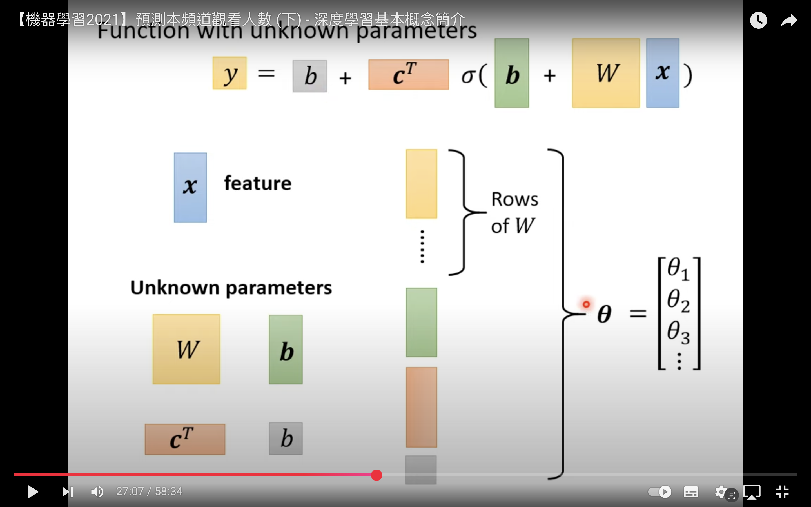
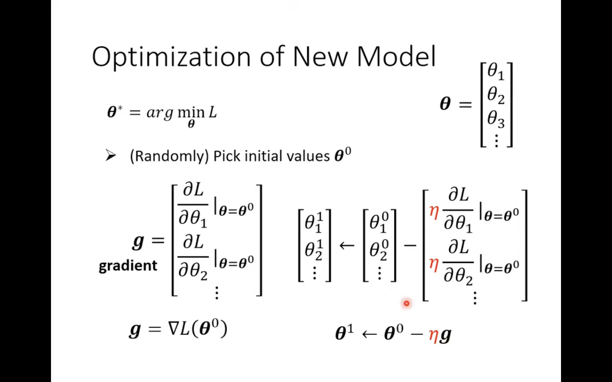

# What is Machine Learning?
- Let machine able to find for a function
- Examples:
    1. Speech recognition : Input a voice, output the correspond text
    2. Image recognition : Input a cat image, output "cat"
    3. Playing Go : Input a chessboard, output the next move
## Types
1. Regression: The function outputs a scalar
    - predicting tomorrow PM2.5 
2. Classification: Given options(classes), the function outputs the correct one.
    - Spam filtering: input an email, output is this email is spam or not(yes/no).
    - Can have multiple choices to output, ex: alpha go have 19*19 classes to be the next move.
3. Structured Learning
    - create something with structure (image, document)
    - We want machine to create something
## How to find function?
1. Function with unknown parameters
    - guess the possible parameters, $y = b + wx_1$
        - y : prediction output, no. of views on 2/26
        - x_1 : previous data, no. of views on 2/25
        - w, b : unknown parameters, learned from data
    - Model : $y = b + wx_1$ (linear model)
    - feature : $x_1$
    - weight : w, mulitply with feature
    - bias : b
2. Define Loss from training data
    - Loss is a function of parameters
        - L(b,w)
    - Loss output how good a set of values is
    - EX: L(0.5k,1)
        - $y = 0.5k + 1x_1$
        - y_pred = 0.5k + 1*4.8k = 5.3k
            - y_true = 4.9k (from training data), called **label**
        - $e_1 = |y_{pred} - y_{true}| = 0.4k$
            - Calculate with all training data to get all $e_1 to e_N$ (N training data)
        - Loss: $L = {{1} \over {N}} \sum_{1}^{n} e_n$
            - Using absolute to calculate loss -> **MAE** mean absolute error
                - $e = |y_p - y_t|$
            - **MSE** mean square error
                - $e = (y_p - y_t)^2$
            - If y_pred and y_true are both probability distributions
                - Use **cross-entropy**
3. Optimization
    - Find a **w** and **b** to let Loss to be minimum
    - Gradient Descent
        - Randomly pick an initial value $w_0$
        - Compute $dL \over dw$, starting ${dL \over dw}|_{w=w_0}$
            - if gradient is **negative** -> **increase w**
            - else if **positive** -> **decrease w**
            - Increase/Decrease how much?
                - $\eta :$ Learning rate (**hyperparameters**)
                    - hyperparameters: something you need to set by yourself when training
        - Update w iteratively
            - $w_1 = w_0 - \eta * {dL \over dw}|_{w=w_0}$
    - With multiple parameters **w,b**
        - Randomly pick initial values $w_0,b_0$
        - Compute $dL \over dw$ and $dL\over db$
        - Update **w** and **b** iteratively 
- How to modify the model? (Linear -> Neural Network)
    - Require domain knowledge about the problem
    - Design a more flexible model (to escape model bias)
        - Piecewise linear curves
            - approximate continuous curve with multiple piecewise linear curve
            - use sigmoid function to use as piecewise linear curve (**Hard Sigmoid**)
            - $y = c*{1 \over 1 + e^{-(b+w*x_1)}} = c*sigmoid(b+w*x_1)$
                - Different w -> change slopes
                - Different b -> shift the curve
                - Different c -> change height of the curve
            - 
            - 
        - New model
            - 
            - Randomly pick initial value $\theta _0$
            - Compute gradient $g={dL\over d\theta}$
            - Update $\theta _i = \theta _{i-1} - \eta * g$
## Batch
- 1 epoch will look all batch
- In a epoch, it will run through all batch (each batch will update $\theta$ once)
- Example: 10,000 examples
    1. Batch size=10, in a epoch will update 1000 times
    2. Batch size=100, in a epoch will update 100 times

## ReLU
- Rectified Linear Unit
- $y = c* max(0, b+w*x_1)$
## terms
- Model bias
    - limitation of model
- Neuron
    - The activation function of each node
- Neural Network
    - The model architecture of combining lots of neuron
- Hidden layer
    - each layer in Neural Network
- Deep Learning
    - Machine learning with many layers(hidden)
- Overfitting
    - Situation of better on training data but worse on unseen data(validation/test)
    