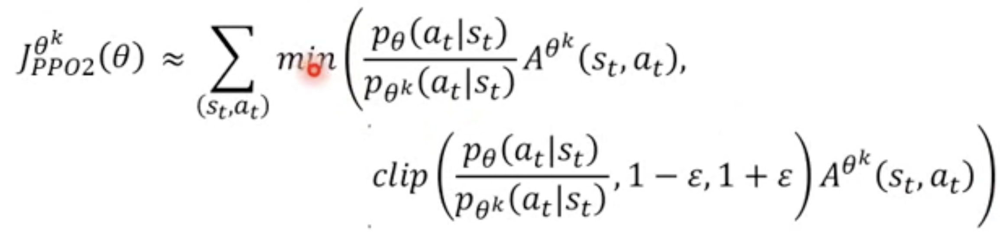

# Proximal Policy Optimization
- KL divergence, Constraint on behavior not parameters
- TRPO (Trust Region Policy Optimization)
    - Using constraint $KL(\theta,\theta') < \delta$
- PPO use KL divergence to estimate the difference between $\theta$ and $\theta'$ (difference on behavior)

## PPO algorithm
1. Initial policy parameters $\theta^0$
2. In each iteration
    - Using $\theta^k$ to interact with the environment to collect {$s_t,a_t$} and compute advantage $A^{\theta^k}(s_t,a_t)$
    - Find $\theta$ optimizing $J_{PPO}(\theta)$(Update parameters several times)
    $$J_{PPO}^{\theta^k}(\theta) = J^{\theta^k}(\theta) - \beta KL(\theta,\theta^k)$$
    - If $KL(\theta,\theta^k)>KL_{max}$,increase $\beta$
    - If $KL(\theta,\theta^k)<KL_{min}$,decrease $\beta$

## PPO2 algorithm

- clip
    - If $output < 1-\epsilon \to output = 1-\epsilon$
    - If $output > 1+\epsilon \to output = 1-\epsilon$
    - Want to make sure $p^{\theta}$ and $p^{\theta^k}$ don't be too much difference
        - When $p^{\theta}$ is good -> increase $p^{\theta}$ but not more than $1+\epsilon$, vice versa.