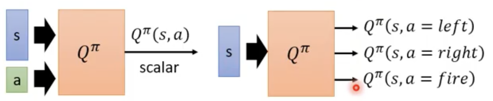

# Critic
- Given an actor $\pi$, it evaluates how good the actor is
- The output values of a critic depend on the actor evaluated

## State value function
- $V^{\pi}(s)$
- When using actor $\pi$, the cumulated reward expects to be obtained after visiting state s
- Given a state s, $V^{\pi}(s)$ output a scalar, the expected reward that accumulated after state s using actor $\pi$

### Monte-Carlo (MC) based approach
- The critic watches $\pi$ playing the game, after seeing $s_a$ the cumulated reward is $G_a$ when end of the episode
- Use a network (regression problem) to input a state $s_a$ and output a scalar $V^{\pi}(s_a)$ with y_true is $G_a$
- Loss function = $V^{\pi}(s_x) <-> G_x $
- Need to play the whole game to collect the $G_x$

### Temporal-difference (TD) approach
- $V^{\pi}(s_t) = V^{\pi}(s_{t+1}) + r_t$
    - $r_t$ : Gain reward at $s_t$ with $a_t$
- Loss function = $(V^{\pi}(s_t) - V^{\pi}(s_{t+1}) ) <-> r_t $

### MC vs. TD
- MC have larger variance, $G_a$ is the summation of many steps
    - $Var[kX] = k^2Var[X]$
- TD may be inaccurate, because $V^{\pi}(s_{t+1})$ may be inaccurate
- The critic has the following 8 episodes:
    1. $s_a,r=0,s_b,r=0,END$
    2. $s_b,r=1,END$ * 6 times
    8. $s_b,r=0,END$
        - $V^{\pi}(s_b) = {3 \over 4}$ , $V^{\pi}(s_a) = ? (0,{3\over 4})$
        - MC -> $V^{\pi}(s_a) = 0$
        - TD -> $V^{\pi}(s_a) = V^{\pi}(s_b) + r = {3 \over 4} + 0 = {3 \over 4}$

## State-action value function 
- $Q^{\pi}(s,a)$
- Output the cumulated reward expects to be obtained after taking action **a** at state **s** when using action $\pi$
- 
- Given a policy $\pi$ (interacts with environment)-> Learn $Q^{\pi}(s,a)$ -> Find a new actor $\pi'$ (better than $\pi$) -> interacts with environment
    - Better : $V^{\pi'}(s) \ge V^{\pi}(s)$, for all state **s**
    - $\pi'(s) = arg \displaystyle\max_a Q^{\pi}(s,a)$
        - All action at state **s**, the maximum value with action **a** is the action of $\pi'(s)$
        - $\pi'$ does not have extra parameters, it depends on Q
### Proving $\pi'$ is better than $\pi$
- $\pi'(s) = arg \displaystyle\max_a Q^{\pi}(s,a)$
- $V^{\pi'}(s) \ge V^{\pi}(s)$, for all state **s**
1. $V^{\pi}(s) = Q^{\pi}(s,\pi(s)) \le \displaystyle\max_a Q^{\pi}(s,a) = Q^{\pi}(s,\pi'(s))$
2. $V^{\pi'}(s) \le Q^{\pi}(s,\pi'(s))$ 
    - Note : Only follow $\pi'$ at state **s** other will use $\pi$
3. $E[r_t + V^{\pi}(s_{t+1})|s_t = s, a_t = \pi'(s_t)] \le E[r_t + Q^{\pi}(s_{t+1},\pi'(s_{t+1}))|s_t = s, a_t = \pi'(s_t)] $ 
    - Extend to $r_{t+1} \to ... \to r_n \to Proved$

### Tips
1. Target network : Use 2 network, one use to train and one fixed as target network
    - train network input $s_t,a_t$, output $Q^{\pi}(s_t,a_t)$
    - target network input $s_{t+1},\pi(s_{t+1})$, output $Q^{\pi}(s_{t+1},\pi(s_{t+1}))$
    - Loss function = $r_t + Q^{\pi}(s_{t+1},\pi(s_{t+1}))$
    - After severals update of train network then update target network using train network(replace target network, target network is fixed when training train network)
2. Exploration
