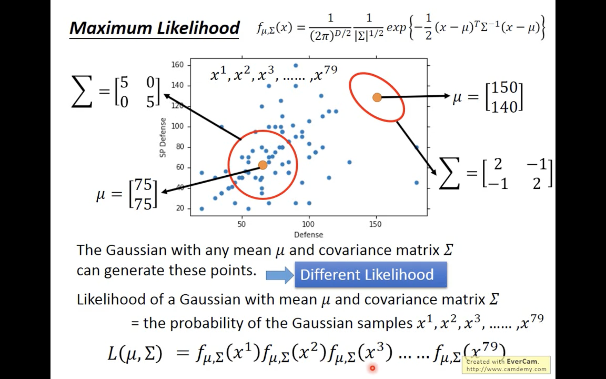
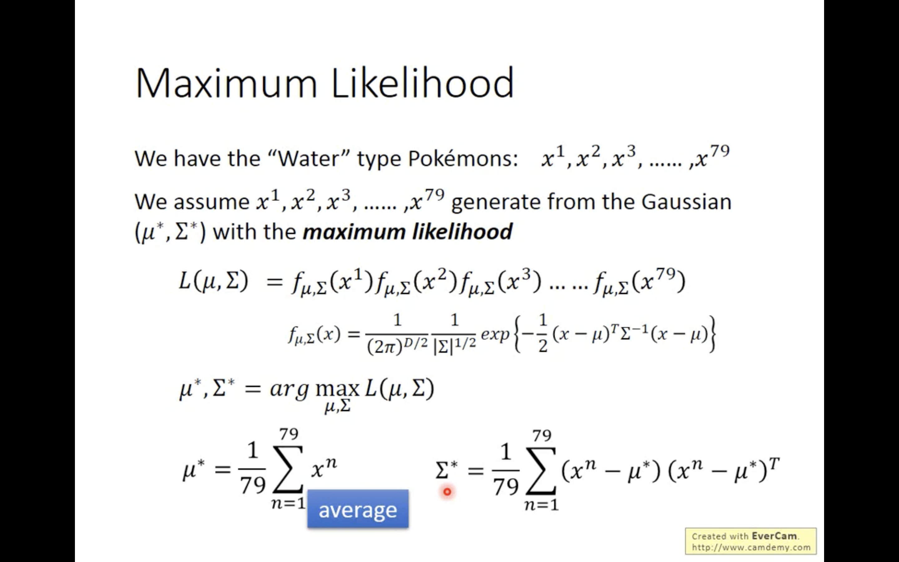
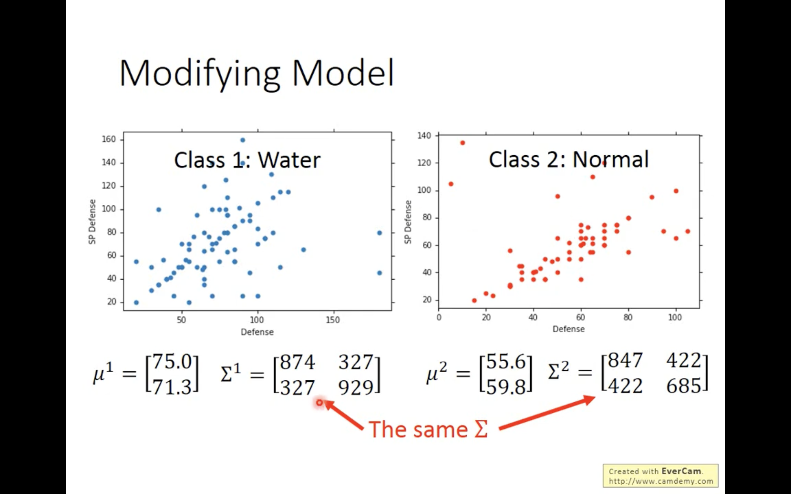
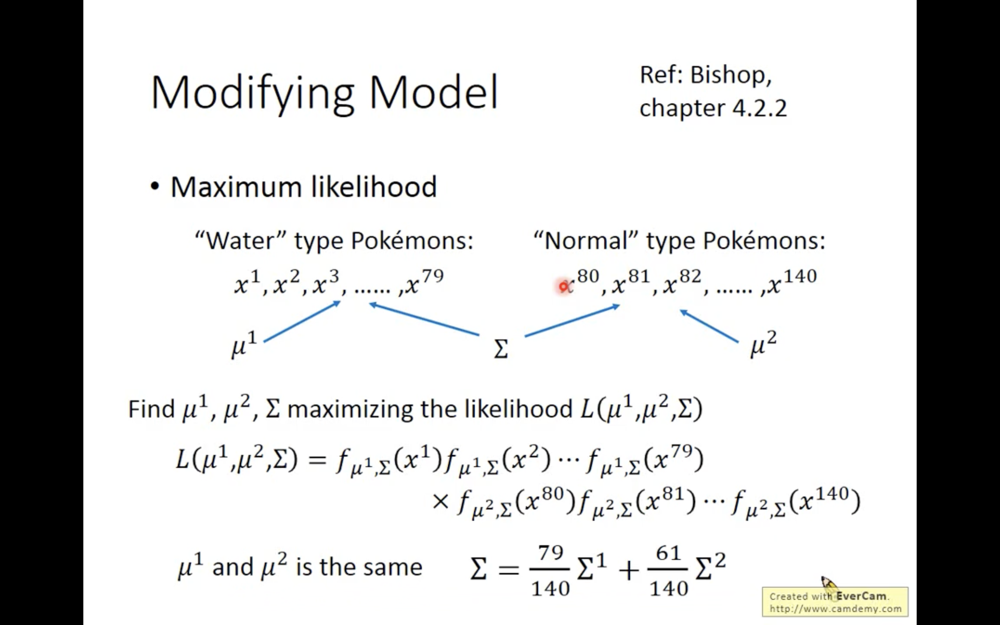
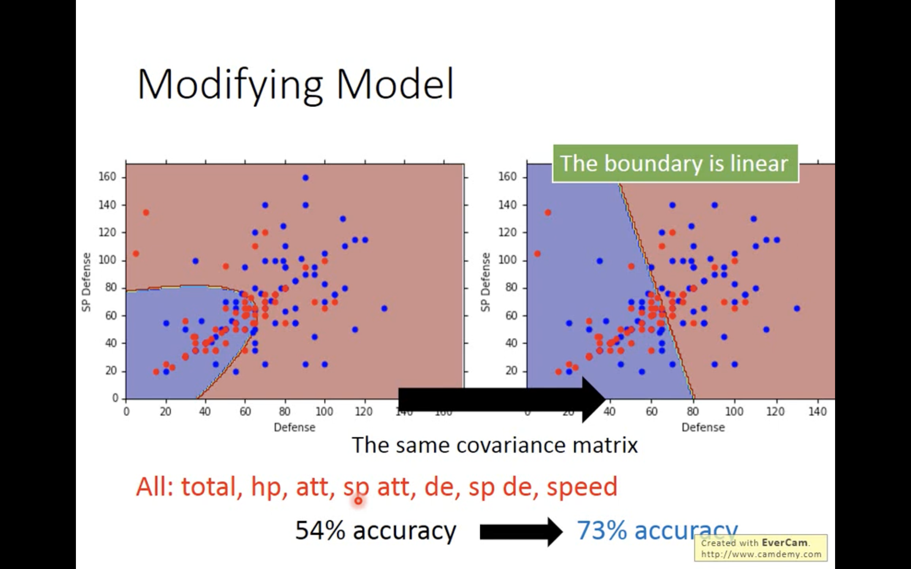
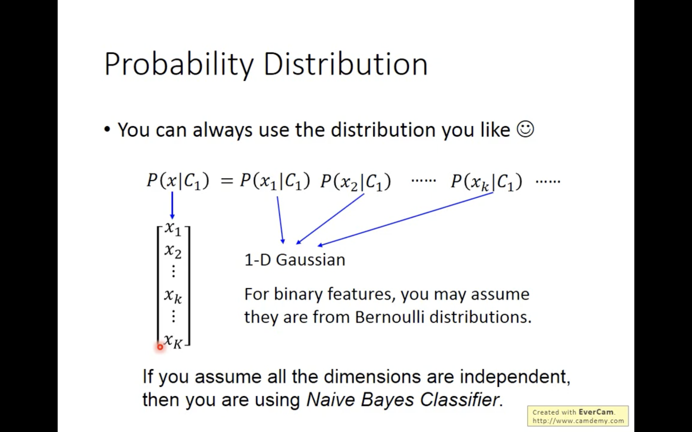
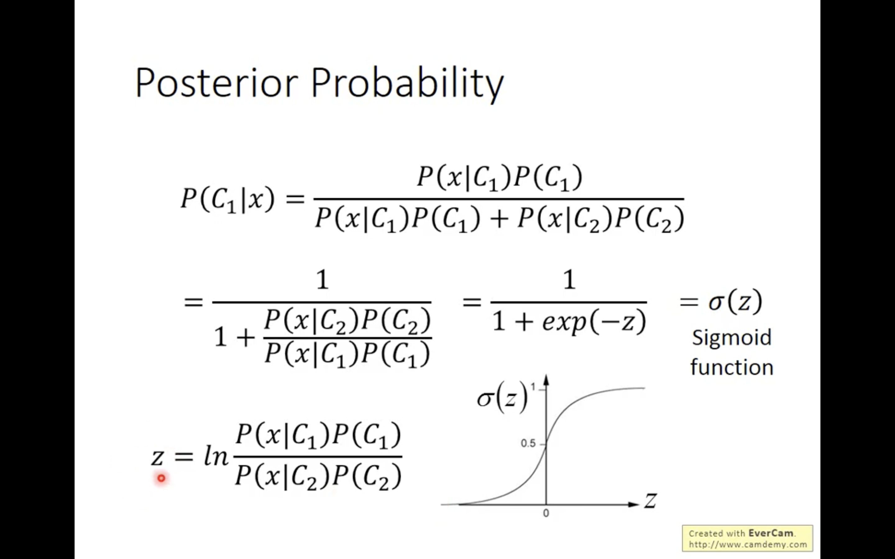
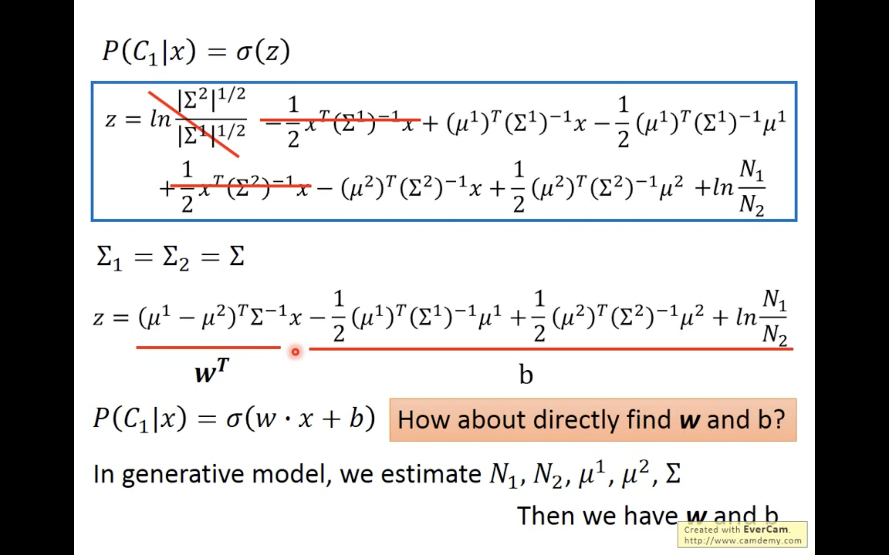

- Any gaussian distribution can sample all 79 points but have **different likelihood** to generate these points
- Bottom-left gaussian distribution have higher likelihood to generate these points than upper-right
- $\mu : mean, \sum : Covariance$

- We always want the maximum likehood of gaussian distribution 

- What if we use the same $\sum (covariance)$ to both class?

- Likelihood become: $\mu^1 and \mu^2$ are still the same, we only combine the $\sum^1$  and $\sum^2$ into $\sum$

- The accuracy become much more better when sharing the same $\sum (covariance)$

- We can use whatever distribution that suitable to the specific task
- If we assume the dimensions are all independent $\to$ **Naive Bayes Classifier**

- If we do something to the **Posterior Probability** we can get something interesting

- After some math calculation, we get that it is some **w** and **b**  
- This also explain why share the same $\sum (covariance)$ with classes will get linear boundary

# **Bias & Variance**
- Large bias $\to$ Underfitting
    - If model cannot even fit the training data
    - Need to redesign model
        1. Add more features
        2. A more complex model
- Large variance $\to$ Overfitting
    - If model can fit the training data, but have large error on testing data
    1. More data can effectively control variance, but not always practical
        - generate data(flip image, rotate, ...)
        - collect data
    2. Regularization
- Model selection
    - Balance two kinds of errir to minimize total error
    - Use validation to choose model
        - N-fold Cross Validation