```
1=class1 
2=class2
3=class3
```
- If using only above method, will hint class1 similar with class2, class1 not similar with class3, ...

- Use one-hot vector to represent class will solve above problem
- Use softmax to normalize the output to 0~1

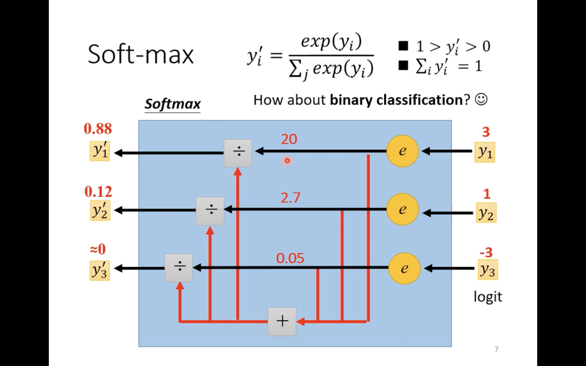
- Using softmax in binary classification is also fine, but common is sigmoid

## Loss of classification

$$ L = {1 \over N} \sum_n {e_n}$$

1. MSE(Mean Square Error)

$$e = \sum_i {(\hat y - y_i')^2} $$

2. Cross-Entropy

$$e = - \sum_i {\hat y_i *ln(y_i') }$$

- **Minimizing cross-entropy** == **maximizing likelihood**
- pytorch bind softmax and cross-entropy together

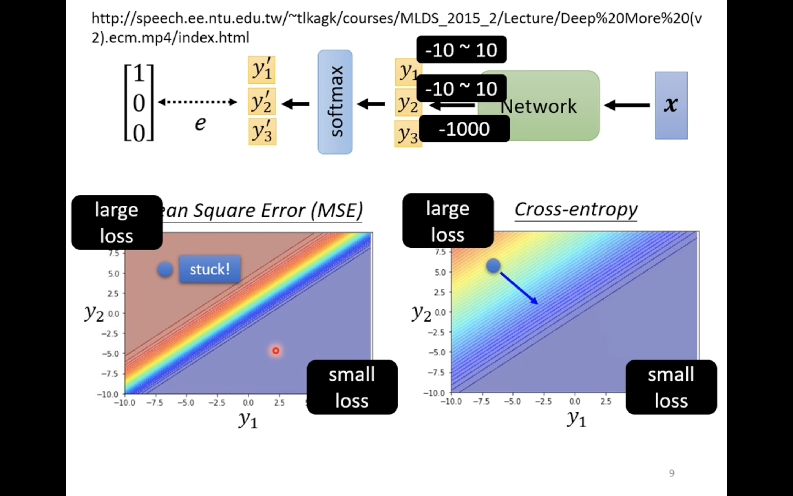
- Cross-entropy is better than MSE, check the link to see the proving
- In the picture example, we can see from the graph, if we choose MSE to be loss function, and if we initial point is at the blue dot
    - MSE will not have gradient -> hard to train (using Adam may solve but still hard)
    - Cross-entropy will have gradient and able to train

## Batch normalization

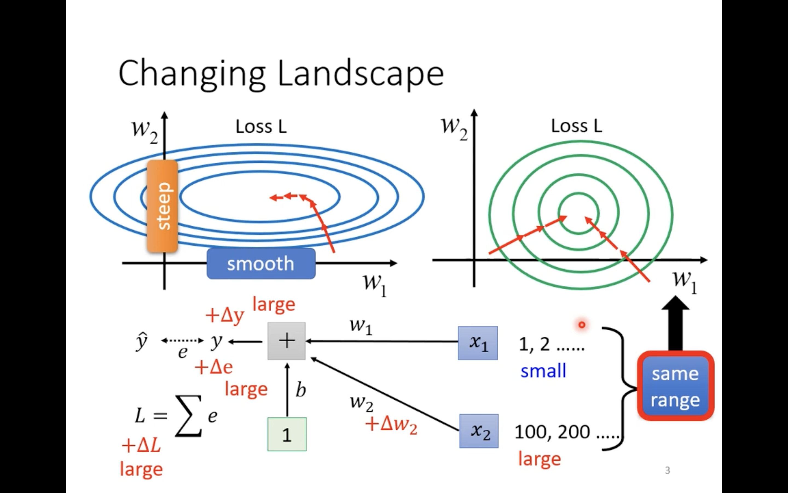
- $\Delta w$ will affect $\Delta y \to \Delta e \to \Delta L$ 
- When **Input size** is **large**, small changes in w ($\Delta w$) will make huge impact in **Loss**, vice versa
- So we can change the range of input into same range


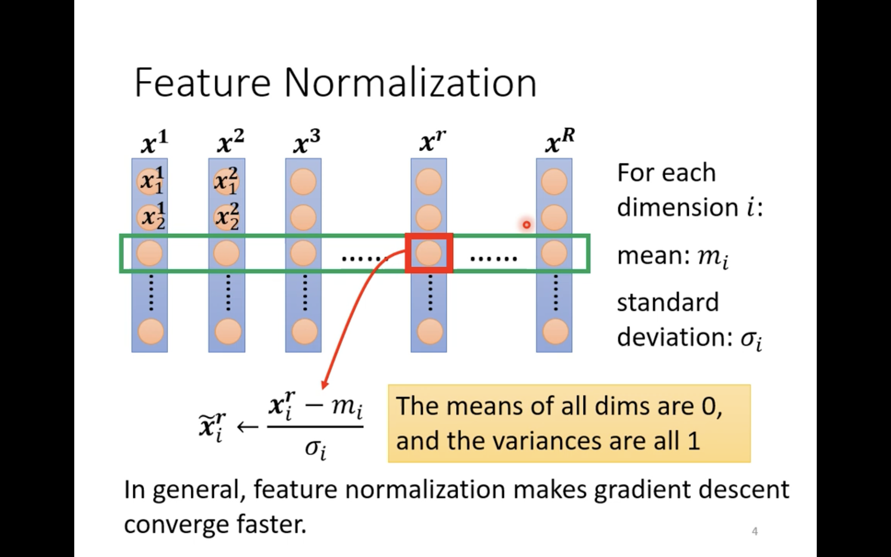
- Normalize feature(dimension)

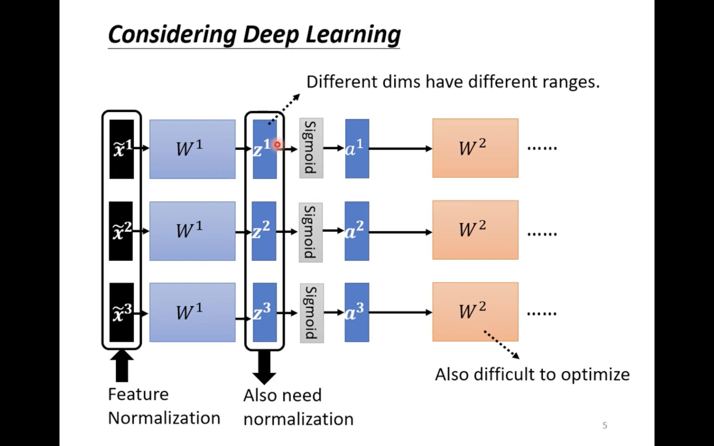
- When come to deep network
- We need to normalize `z` or `a`, because after normalized input pass W will give different ranges to `z`
- Normalizing either `z` or `a` will be no different
- But when the activation function is sigmoid, we always want to normalize `z`


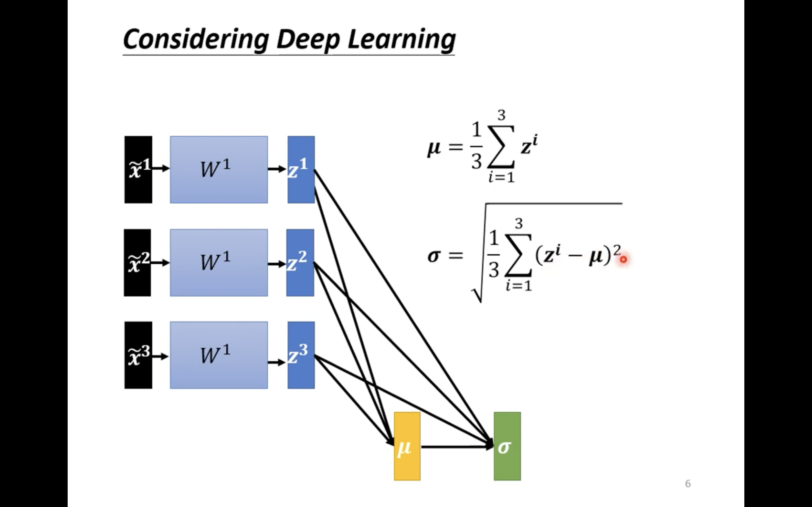
- We first calculate $\mu$ and $\alpha$

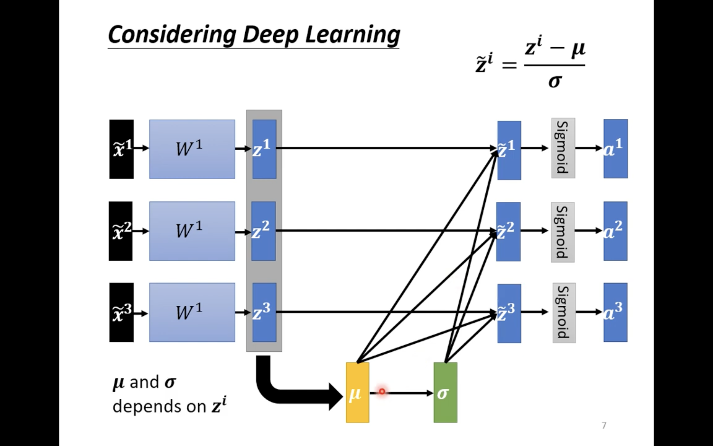
- Then use $\mu$ and $\alpha$ to normalize `z`
    - element wise operations

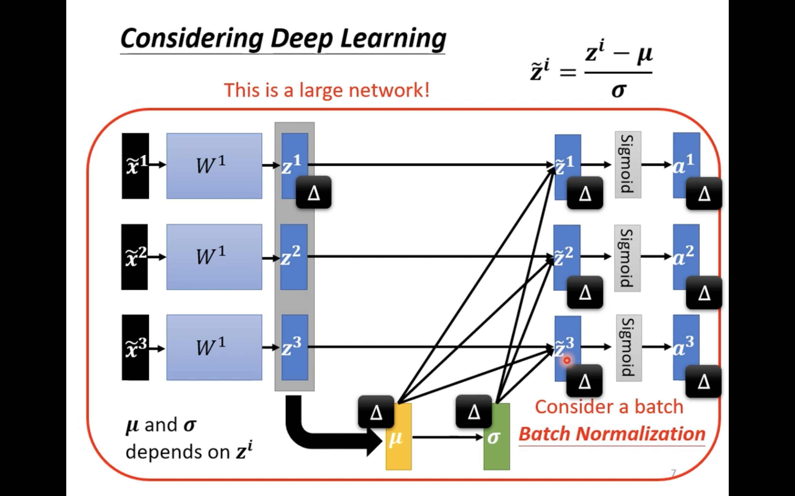
- Doing normalize of `z` takes lots of memory, is a large network
- So we always do on batch, called **Batch normalization**
    - suitable for large batch

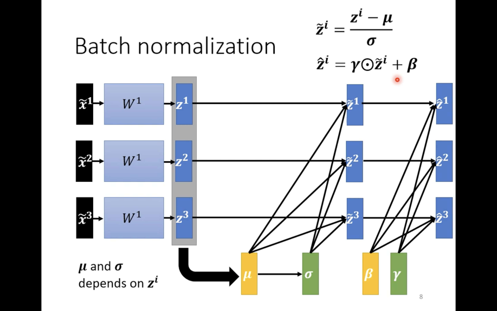
- $\beta$ is a zero vector(initial)
- $\gamma$ is a one vector(initial)
- Both are trainable parameters, to make mean of $\hat z$ not 0, after some traning process
    - mean of z == 0, may make some issues to the network
    - when starting the training, the network will initial $\gamma$ to one vector and $\beta$ to zero vector to have similar distribution of dimension
    - after some training process, we can add back $\gamma$ and $\beta$ to prevent issues cause by mean == 0

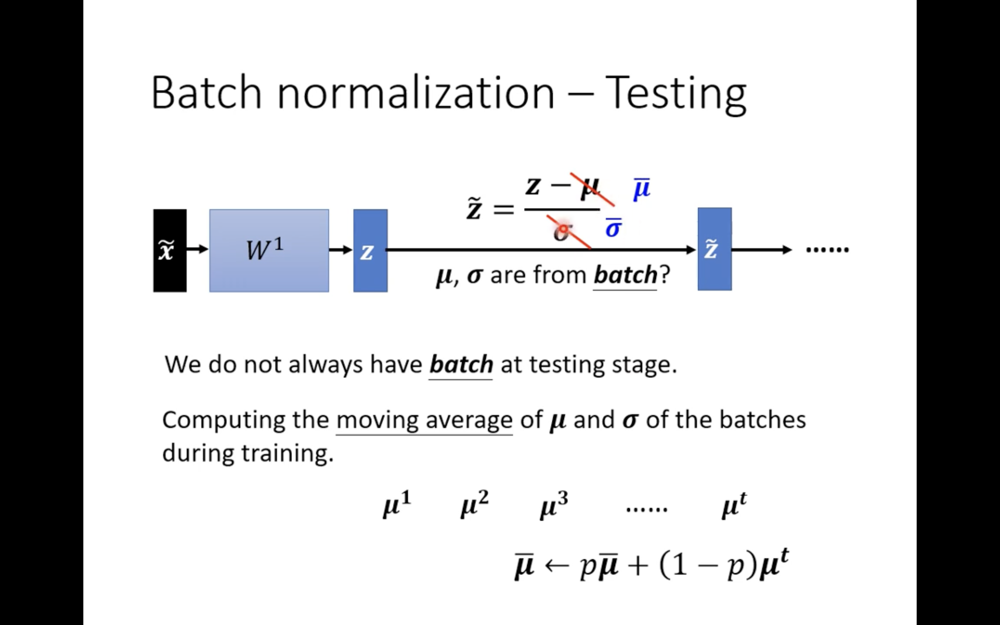
- In testing process, we do not have $\mu$ and $\alpha$ because is only 1 example
- In pytorch, it will calculate **moving average** of $\mu ^i$ and $\alpha ^i$
    - $p$ is another **hyperparameter** we can adjust

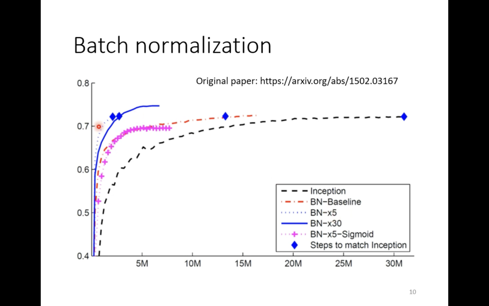
- A study showing that batch normalization can converge faster and have better performance

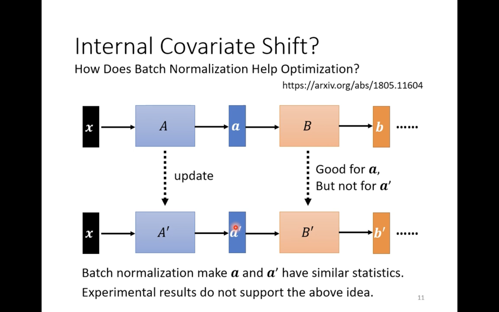
- A study showing that batch normalizatin is better **does not** because it solve **internal covariate shift**

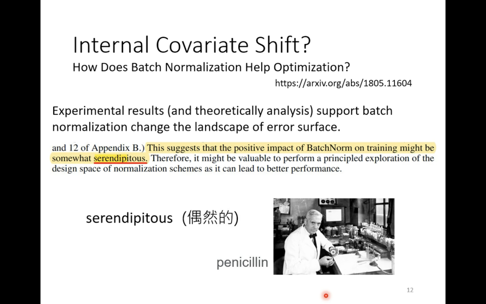

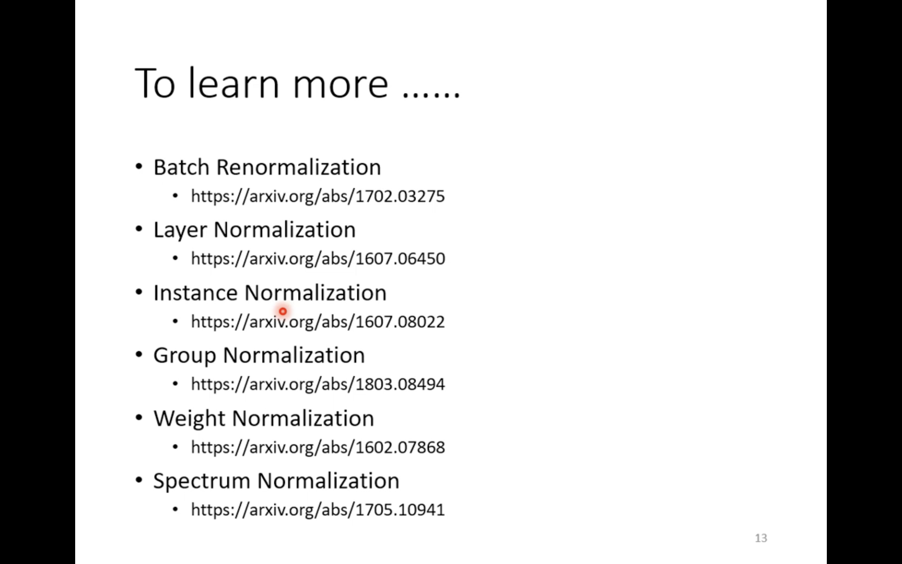